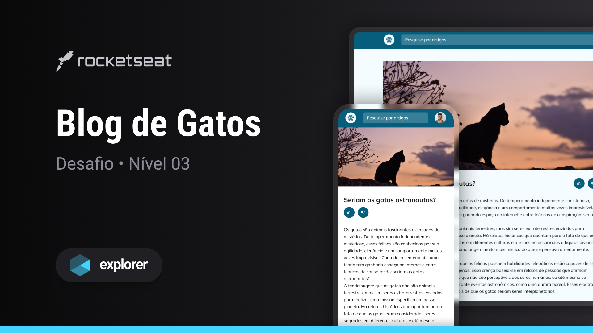

<h1 align="center"> Blog de Gatos</h1>

Explorer | Stage 03 - Desafio Blog de Gatos

  <a href="#-tecnologias">Tecnologias</a>&nbsp;&nbsp;&nbsp;|&nbsp;&nbsp;&nbsp;
  <a href="#-projeto">Projeto</a>&nbsp;&nbsp;&nbsp;|&nbsp;&nbsp;&nbsp;
  <a href="#-licença">Licença</a>&nbsp;&nbsp;&nbsp;|&nbsp;&nbsp;&nbsp;
  <a href="#autor">Autor</a>

  

 

  

## 🚀 Tecnologias

Esse projeto foi desenvolvido com as seguintes tecnologias:

- HTML
- CSS
- JS

## 💻 Projeto

O Blog de Gatos é um desafio do Stage 03 do curso Explorer da [Rocketseat](https://www.rocketseat.com.br/).

O desafio proposto foi desenvolver uma página, utilizando variáveis, animações, grid e o principal, deixar responsiva para que seja possível visualizá-la de maneira agradável tanto em dispositivos móveis quanto em dispositivos com telas maiores.

Alguns dos conceitos e conhecimentos aplicados:

- Mobile First
- Responsividade
- Media queries
- Break points
- Unidade de medida flexível
- Grid
- Variáveis no CSS
- Animações e transições simples
- Cores HSL

Aproveitei a oportunidade e adicionei também um extra, desenvolvendo a funcionalidade de pesquisa por artigos, que faz um filtro nos artigos que da seção **Artigos Relacionados**.

## 📝 Licença

Esse projeto está sob a licença MIT.

## Autor

 

Feito com 💜 por Jordane Chaves